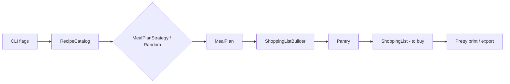
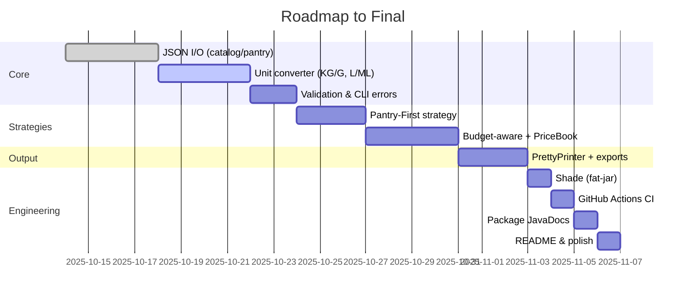

# Project Roadmap — Meal Planner / Grocery List Generator

> Mid-semester prototype evolving to a polished final deliverable.  
> Tech: Java 21, Maven, JUnit 5. Patterns: **Strategy**, **Builder**, Facade(Service).

---

## 1) Project Description (purpose, audience, service)

**Purpose.** A small CLI application that plans meals for *N* days and produces an aggregated **shopping list**. It merges duplicate ingredients by **(name, unit)** and subtracts a user's **pantry** stock to output only the **items to buy**.

**Audience.** Busy students or families who want a quick weekly plan and a consolidated grocery list; instructors reviewing design pattern usage.

**Service.**  
`choose recipes → plan (days × meal types) → aggregate ingredients → subtract pantry → print/export list`

---

## 2) Current Status (prototype)

- In-memory **sample recipe catalog**
- **RandomStrategy** (Strategy) picks recipes for the requested **MealType[]** per day
- **ShoppingListBuilder** (Builder) aggregates ingredients by `(name, unit)` (case/whitespace-insensitive names)
- **Pantry** subtraction to produce the **difference list**
- **CLI** flags: `--days`, `--meals`, `--seed`, `--pantry`
- **JUnit 5** tests are green; core classes have JavaDoc
- README documents usage & patterns

---

## 3) Visual Outline (flow)



---

## 4) Scope to Final (planned features)

**Core**
- JSON I/O for **RecipeCatalog** and **Pantry** (load/save with Jackson)
- **UnitConverter** for KG↔G, L↔ML (opt‑in in builder)
- Robust input validation & helpful CLI errors

**Strategies**
- **PantryFirstStrategy** (prefer recipes that consume existing stock)
- **BudgetAwareStrategy** with **PriceBook** + `--budget`

**Output / UX**
- **PrettyPrinter** (group/sort/align/totals); exports: `--out csv|md`
- CLI ergonomics: `--plan-only`, `--list-only`, `--dry-run`

**Engineering**
- Runnable **fat‑jar** via Maven Shade; example run scripts
- **GitHub Actions** CI; package‑level JavaDoc

---

## 5) Milestones & Timeline

> Adjust dates to your course calendar. Each block is sized so work is incremental and testable.



---

## 6) Definition of Done (DoD) — maps to the Rubric

**Code**
- Design patterns **identified** and **implemented** (Strategy, Builder; Facade).
- Service clearly demonstrated: **plan → aggregate → subtract → print/export**.
- Partial functionality **runnable** via CLI; deterministic runs with `--seed`.

**Roadmap**
- This document provides a **project description** (audience/purpose) and a **visual outline** (Mermaid flow + Gantt).

**Testing / Comments**
- **JUnit** tests for builder, strategy, pantry, and CLI parsing edge cases.
- **JavaDoc** for core classes and `package-info.java` (domain rules, invariants).

---

## 7) Risks & Mitigations

- **Unit conversion complexity.** Limit to KG↔G and L↔ML for final; document unsupported conversions.
- **Budget data quality.** Use a simple `PriceBook` JSON schema; validate entries and fall back gracefully.
- **Time constraints.** Keep each milestone independently shippable; prioritize Core → Strategies → Output → Engineering.

---

## 8) Example Commands (quick reference)

```
# default: 2 days, lunch+dinner, seed=7
mvn -q exec:java

# custom
mvn -q exec:java -Dexec.args="--days 3 --meals breakfast,lunch,dinner --seed 42"

# with pantry stock
mvn -q exec:java -Dexec.args="--days 2 --meals lunch,dinner --pantry milk=200:ML,egg=1:PCS"
```

For more, see **README.md**.

---

## 9) JSON Sketches (for upcoming persistence)

**RecipeCatalog (draft)**
```json
{
  "recipes": [
    {
      "name": "Pasta",
      "ingredients": [
        { "name": "pasta", "amount": 100, "unit": "G" },
        { "name": "olive oil", "amount": 15, "unit": "ML" }
      ],
      "tags": ["VEG"]
    }
  ]
}
```

**Pantry (draft)**
```json
{
  "stock": [
    { "name": "milk", "amount": 200, "unit": "ML" },
    { "name": "egg",  "amount": 1,   "unit": "PCS" }
  ]
}
```

---

## 10) References

- Patterns used: Strategy, Builder, Facade(Service) — visible in code (`strategy/`, `ShoppingListBuilder`, `MealPlannerService`).
- Testability by design: deterministic `RandomStrategy` with seed injection; immutable domain models.
